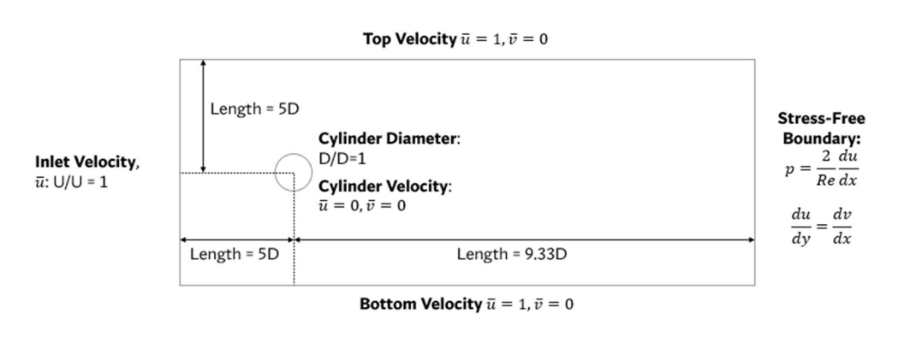
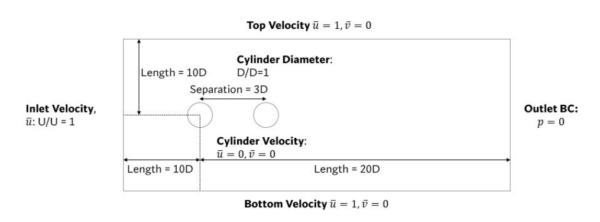

# Extended-Physics-Informed-Neural-Networks
National University of Singapore Mechanical Engineering Final Year Project

The Extended Physics Informed Neural Network (xPINN) is an extension to the original Physics Informed Neural Network. In this project, the xPINN was subjected to various use cases to strike a comparison between the xPINN and the PINN.

    
    <em>   Overview of the xPINN Structure</em>

# Flow Problems
The following flow problems were used in this project.
1. Flow past single cylinder

    
    <em>   Flow Past Single Cylinder Setup</em>

2. Flow past two cylinders in tandem

    
    <em>   Flow Past Two Cylinders in Tandem Setup</em>

# Results Preview
This section highlights some of the obtained results from the flow past two cylinders in Tandem

    
    <em>   PINN Output</em>

    
    <em>   xPINN Output</em>

# Acknowledgements
This project uses code from [Rao's Repository](https://github.com/Raocp/PINN-laminar-flow) as an experimental baseline while making modifications for the xPINN.

The [Physics Informed Neural Network](https://github.com/maziarraissi/PINNs) and [Extended Physics Informed Neural Network](https://github.com/AmeyaJagtap/XPINNs) were inspired by Raissi et al. and Jagtap et al., where they conducted initial research into these novel frameworks for flow predictions. 
